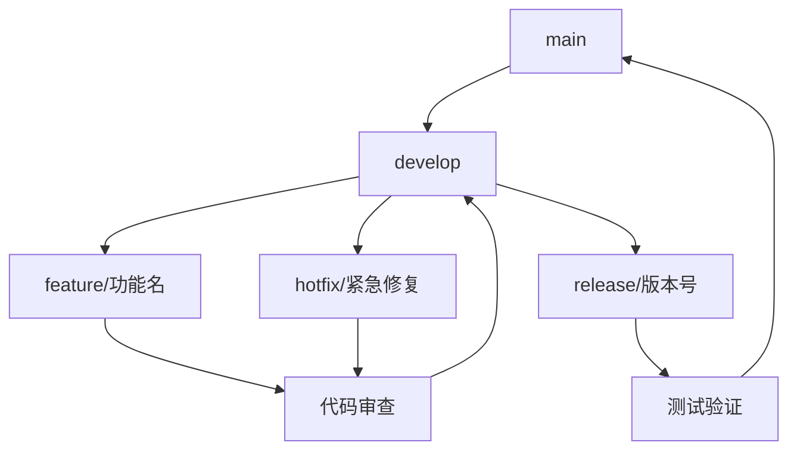
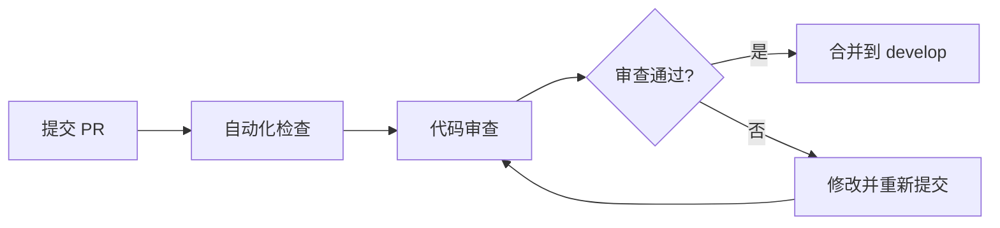

# 贡献指南

## 🤝 欢迎贡献

感谢您对 Auto U2A Polit 项目的关注！我们欢迎各种形式的贡献，包括但不限于：

- 🐛 **Bug 报告**：发现并报告问题
- 💡 **功能建议**：提出新的功能想法
- 🔧 **代码贡献**：修复 Bug 或实现新功能
- 📖 **文档改进**：完善文档和示例
- 🌍 **国际化**：翻译和本地化支持

## 📋 贡献流程

### 1. 准备工作

#### 环境配置
1. **Fork 项目**：在 GitHub 上 Fork 本项目
2. **克隆仓库**：
   ```bash
   git clone https://github.com/your-username/auto-u2a-polit.git
   cd auto-u2a-polit
   ```
3. **配置远程仓库**：
   ```bash
   git remote add upstream https://github.com/original-owner/auto-u2a-polit.git
   ```

#### 开发环境搭建
1. **后端环境**：
   ```bash
   # 安装 JDK 17+
   # 安装 Maven 3.8+
   # 安装 MySQL 8.0+
   # 安装 Redis 6.0+
   ```

2. **前端环境**：
   ```bash
   cd auto-u2a-polit-frontend
   # 安装 Node.js 18+
   npm install
   ```

### 2. 开发流程

#### 分支管理策略


#### 创建功能分支
```bash
# 从 develop 分支创建功能分支
git checkout develop
git pull upstream develop
git checkout -b feature/your-feature-name

# 或者创建修复分支
git checkout -b hotfix/issue-number-description
```

#### 分支命名规范
| 分支类型 | 命名格式 | 示例 |
|---------|----------|------|
| 功能分支 | `feature/功能描述` | `feature/user-authentication` |
| 修复分支 | `hotfix/问题描述` | `hotfix/fix-login-issue` |
| 发布分支 | `release/版本号` | `release/v1.2.0` |
| 文档分支 | `docs/文档主题` | `docs/update-api-docs` |

### 3. 代码开发

#### 开发规范
1. **遵循编码规范**：参考 [开发指南](./docs/development-guide.md)
2. **编写测试用例**：参考 [测试指南](./docs/testing-guide.md)
3. **保持代码简洁**：单一职责，避免重复代码
4. **添加必要注释**：复杂逻辑需要注释说明

#### 提交信息规范
使用 [Conventional Commits](https://www.conventionalcommits.org/) 规范：

```bash
# 格式：<类型>[可选的作用域]: <描述>

# 示例：
feat(auth): add WeChat login support
fix(api): resolve null pointer in user service
perf(table): optimize large dataset rendering
docs(readme): update installation guide
test(user): add unit tests for user service
refactor(utils): extract common validation functions
style(css): fix responsive layout issues
chore(deps): update spring boot to 3.1.0
```

#### 提交类型说明
| 类型 | 描述 | 示例 |
|------|------|------|
| feat | 新功能 | `feat: add user management` |
| fix | Bug 修复 | `fix: resolve login issue` |
| docs | 文档更新 | `docs: update api documentation` |
| style | 代码格式 | `style: format code with prettier` |
| refactor | 代码重构 | `refactor: optimize database query` |
| perf | 性能优化 | `perf: improve page load speed` |
| test | 测试相关 | `test: add unit tests for auth` |
| chore | 构建过程 | `chore: update dependencies` |
| ci | CI 配置 | `ci: add github actions` |

### 4. 测试验证

#### 本地测试
```bash
# 后端测试
mvn test
mvn verify

# 前端测试
cd auto-u2a-polit-frontend
npm run test:unit
npm run test:e2e

# 代码质量检查
mvn checkstyle:check
npm run lint
```

#### 确保测试通过
- 所有现有测试必须通过
- 新功能需要添加相应的测试用例
- 测试覆盖率不能降低

### 5. 提交 Pull Request

#### 创建 PR
1. **推送分支**：
   ```bash
   git push origin feature/your-feature-name
   ```

2. **创建 PR**：在 GitHub 上创建 Pull Request
   - 目标分支：`develop`
   - 标题：遵循 Conventional Commits 规范
   - 描述：详细说明修改内容和影响

#### PR 模板
```markdown
## 📝 修改描述

请详细描述本次修改的内容：

### 🔧 修改类型
- [ ] Bug 修复
- [ ] 新功能
- [ ] 代码重构
- [ ] 文档更新
- [ ] 其他（请说明）

### 🎯 相关 Issue
关联的 Issue 编号：#123

### 📋 修改内容
- 修改点 1
- 修改点 2
- 修改点 3

### 🧪 测试验证
- [ ] 单元测试通过
- [ ] 集成测试通过
- [ ] E2E 测试通过
- [ ] 代码质量检查通过

### 📸 截图/录屏（如适用）

### 🔍 注意事项
需要特别注意的事项
```

## 🎯 代码审查流程

### 审查标准
1. **代码质量**：符合编码规范，无重复代码
2. **功能正确性**：实现功能符合需求
3. **测试覆盖**：有足够的测试用例
4. **性能影响**：不会引入性能问题
5. **安全考虑**：无安全漏洞

### 审查流程


### 审查要点
- ✅ 代码符合项目规范
- ✅ 功能实现正确完整
- ✅ 测试用例覆盖充分
- ✅ 文档更新及时
- ✅ 无性能回归
- ✅ 无安全风险

## 📚 文档贡献

### 文档结构
```
docs/
├── api-documentation.md     # API 接口文档
├── database-design.md       # 数据库设计
├── deployment.md           # 部署文档
├── development-guide.md    # 开发指南
├── testing-guide.md        # 测试指南
└── sql/
    └── init.sql           # 数据库初始化脚本
```

### 文档编写规范
1. **使用 Markdown 格式**
2. **包含清晰的标题结构**
3. **提供代码示例和截图**
4. **保持语言简洁准确**
5. **及时更新相关文档**

## 🐛 Bug 报告

### 报告模板
```markdown
## 🐛 Bug 描述

### 环境信息
- 操作系统：Windows 10 / macOS 12 / Ubuntu 20.04
- 浏览器：Chrome 98 / Firefox 97 / Safari 15
- 版本：v1.0.0

### 重现步骤
1. 第一步
2. 第二步
3. 第三步

### 预期行为
描述期望的行为

### 实际行为
描述实际发生的行为

### 截图/日志
相关的错误日志或截图

### 附加信息
其他相关信息
```

## 💡 功能建议

### 建议模板
```markdown
## 💡 功能建议

### 需求描述
详细描述功能需求

### 使用场景
在什么场景下需要这个功能

### 解决方案建议
如果有实现建议，可以在这里提出

### 优先级
- [ ] 高优先级
- [ ] 中优先级
- [ ] 低优先级
```

## 🏆 贡献者权益

### 贡献者名单
所有贡献者将被记录在项目的 [CONTRIBUTORS.md](./CONTRIBUTORS.md) 文件中。

### 特殊贡献
对于重大贡献者，我们将：
- 在发布说明中特别感谢
- 授予项目维护者权限（如适用）
- 在项目文档中永久记录贡献

## 🚨 行为准则

### 社区准则
我们遵循 [贡献者公约](https://www.contributor-covenant.org/) 行为准则：

1. **友好尊重**：保持友好和尊重的交流氛围
2. **包容开放**：欢迎不同背景和经验的贡献者
3. **专业负责**：对自己的代码和行为负责
4. **建设性反馈**：提供建设性的代码审查意见

### 不可接受的行为
- 使用性暗示语言或图像
- 嘲讽、侮辱/贬损的评论和个人或政治攻击
- 公开或私下的骚扰行为
- 未经明确许可发布他人的私人信息
- 其他不专业或不合适的行为

## 🔧 开发工具推荐

### IDE 配置
- **VS Code**：安装 Vue、Java、Spring Boot 相关插件
- **IntelliJ IDEA**：配置代码风格和 Live Templates
- **WebStorm**：配置 Vue 和 TypeScript 支持

### 浏览器工具
- **Vue Devtools**：Vue 应用调试
- **Redux DevTools**：状态管理调试
- **React Developer Tools**：React 组件调试

## 📞 获取帮助

### 沟通渠道
- **GitHub Issues**：问题报告和功能建议
- **Discord/Slack**：实时交流和讨论
- **邮件列表**：重要公告和讨论

### 常见问题
1. **如何开始贡献？**
   - 从简单的 Bug 修复或文档改进开始
   - 阅读项目文档了解架构和规范

2. **代码审查需要多长时间？**
   - 通常会在 2-3 个工作日内完成审查
   - 复杂修改可能需要更长时间

3. **如何成为核心贡献者？**
   - 持续做出高质量贡献
   - 积极参与项目讨论和维护
   - 经现有维护者推荐

---

## 🙏 致谢

感谢所有为这个项目做出贡献的开发者！您的每一行代码、每一个建议、每一次测试都让这个项目变得更好。

**让我们一起构建更好的 Auto U2A Polit！**

---

*最后更新：2024年1月*

如有任何问题，请通过 GitHub Issues 联系我们。