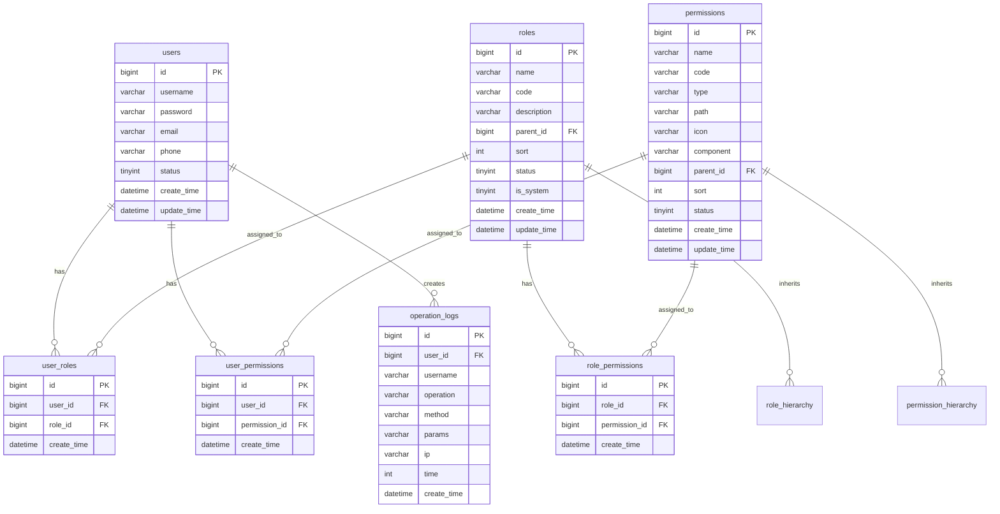

# 数据库设计文档

## 📋 文档说明

本文档详细描述了 Auto U2A Polit 系统的数据库设计，包括表结构、字段定义、索引设计、关系模型等内容。

## 🗄️ 数据库概览

### 数据库信息
- **数据库名**: `auto_u2a_polit`
- **字符集**: `utf8mb4`
- **排序规则**: `utf8mb4_unicode_ci`
- **引擎**: `InnoDB`

### 表关系图


## 📊 表结构详情

### 1. 用户表 (users)

**表说明**: 存储系统用户信息

| 字段名 | 类型 | 长度 | 允许空 | 默认值 | 说明 |
|--------|------|------|--------|--------|------|
| id | bigint | 20 | NO | AUTO_INCREMENT | 主键ID |
| username | varchar | 50 | NO | | 用户名，唯一 |
| password | varchar | 100 | NO | | 密码（BCrypt加密） |
| email | varchar | 100 | YES | NULL | 邮箱地址 |
| phone | varchar | 20 | YES | NULL | 手机号码 |
| status | tinyint | 1 | NO | 1 | 状态：0-禁用，1-启用 |
| create_time | datetime | | NO | CURRENT_TIMESTAMP | 创建时间 |
| update_time | datetime | | NO | CURRENT_TIMESTAMP ON UPDATE CURRENT_TIMESTAMP | 更新时间 |

**索引设计**:
```sql
-- 主键索引
ALTER TABLE users ADD PRIMARY KEY (id);

-- 唯一索引
ALTER TABLE users ADD UNIQUE INDEX uk_username (username);
ALTER TABLE users ADD UNIQUE INDEX uk_email (email);

-- 普通索引
ALTER TABLE users ADD INDEX idx_status (status);
ALTER TABLE users ADD INDEX idx_create_time (create_time);
```

### 2. 角色表 (roles)

**表说明**: 存储系统角色信息，支持角色继承

| 字段名 | 类型 | 长度 | 允许空 | 默认值 | 说明 |
|--------|------|------|--------|--------|------|
| id | bigint | 20 | NO | AUTO_INCREMENT | 主键ID |
| name | varchar | 50 | NO | | 角色名称 |
| code | varchar | 50 | NO | | 角色编码，唯一 |
| description | varchar | 200 | YES | NULL | 角色描述 |
| parent_id | bigint | 20 | YES | NULL | 父角色ID |
| sort | int | 11 | NO | 0 | 排序号 |
| status | tinyint | 1 | NO | 1 | 状态：0-禁用，1-启用 |
| is_system | tinyint | 1 | NO | 0 | 是否系统内置：0-否，1-是 |
| create_time | datetime | | NO | CURRENT_TIMESTAMP | 创建时间 |
| update_time | datetime | | NO | CURRENT_TIMESTAMP ON UPDATE CURRENT_TIMESTAMP | 更新时间 |

**索引设计**:
```sql
-- 主键索引
ALTER TABLE roles ADD PRIMARY KEY (id);

-- 唯一索引
ALTER TABLE roles ADD UNIQUE INDEX uk_code (code);

-- 普通索引
ALTER TABLE roles ADD INDEX idx_parent_id (parent_id);
ALTER TABLE roles ADD INDEX idx_status (status);
ALTER TABLE roles ADD INDEX idx_sort (sort);
```

### 3. 权限表 (permissions)

**表说明**: 存储系统权限信息，支持树形结构

| 字段名 | 类型 | 长度 | 允许空 | 默认值 | 说明 |
|--------|------|------|--------|--------|------|
| id | bigint | 20 | NO | AUTO_INCREMENT | 主键ID |
| name | varchar | 50 | NO | | 权限名称 |
| code | varchar | 100 | NO | | 权限编码，唯一 |
| type | varchar | 20 | NO | | 权限类型：MENU-菜单，BUTTON-按钮，API-接口 |
| path | varchar | 200 | YES | NULL | 路径（菜单类型使用） |
| icon | varchar | 50 | YES | NULL | 图标（菜单类型使用） |
| component | varchar | 200 | YES | NULL | 组件路径（菜单类型使用） |
| parent_id | bigint | 20 | YES | NULL | 父权限ID |
| sort | int | 11 | NO | 0 | 排序号 |
| status | tinyint | 1 | NO | 1 | 状态：0-禁用，1-启用 |
| create_time | datetime | | NO | CURRENT_TIMESTAMP | 创建时间 |
| update_time | datetime | | NO | CURRENT_TIMESTAMP ON UPDATE CURRENT_TIMESTAMP | 更新时间 |

**索引设计**:
```sql
-- 主键索引
ALTER TABLE permissions ADD PRIMARY KEY (id);

-- 唯一索引
ALTER TABLE permissions ADD UNIQUE INDEX uk_code (code);

-- 普通索引
ALTER TABLE permissions ADD INDEX idx_parent_id (parent_id);
ALTER TABLE permissions ADD INDEX idx_type (type);
ALTER TABLE permissions ADD INDEX idx_status (status);
ALTER TABLE permissions ADD INDEX idx_sort (sort);
```

### 4. 用户角色关联表 (user_roles)

**表说明**: 用户和角色的多对多关联关系

| 字段名 | 类型 | 长度 | 允许空 | 默认值 | 说明 |
|--------|------|------|--------|--------|------|
| id | bigint | 20 | NO | AUTO_INCREMENT | 主键ID |
| user_id | bigint | 20 | NO | | 用户ID |
| role_id | bigint | 20 | NO | | 角色ID |
| create_time | datetime | | NO | CURRENT_TIMESTAMP | 创建时间 |

**索引设计**:
```sql
-- 主键索引
ALTER TABLE user_roles ADD PRIMARY KEY (id);

-- 唯一索引
ALTER TABLE user_roles ADD UNIQUE INDEX uk_user_role (user_id, role_id);

-- 外键索引
ALTER TABLE user_roles ADD INDEX idx_user_id (user_id);
ALTER TABLE user_roles ADD INDEX idx_role_id (role_id);
```

### 5. 角色权限关联表 (role_permissions)

**表说明**: 角色和权限的多对多关联关系

| 字段名 | 类型 | 长度 | 允许空 | 默认值 | 说明 |
|--------|------|------|--------|--------|------|
| id | bigint | 20 | NO | AUTO_INCREMENT | 主键ID |
| role_id | bigint | 20 | NO | | 角色ID |
| permission_id | bigint | 20 | NO | | 权限ID |
| create_time | datetime | | NO | CURRENT_TIMESTAMP | 创建时间 |

**索引设计**:
```sql
-- 主键索引
ALTER TABLE role_permissions ADD PRIMARY KEY (id);

-- 唯一索引
ALTER TABLE role_permissions ADD UNIQUE INDEX uk_role_permission (role_id, permission_id);

-- 外键索引
ALTER TABLE role_permissions ADD INDEX idx_role_id (role_id);
ALTER TABLE role_permissions ADD INDEX idx_permission_id (permission_id);
```

### 6. 用户权限关联表 (user_permissions)

**表说明**: 用户和权限的直接关联关系（绕过角色）

| 字段名 | 类型 | 长度 | 允许空 | 默认值 | 说明 |
|--------|------|------|--------|--------|------|
| id | bigint | 20 | NO | AUTO_INCREMENT | 主键ID |
| user_id | bigint | 20 | NO | | 用户ID |
| permission_id | bigint | 20 | NO | | 权限ID |
| create_time | datetime | | NO | CURRENT_TIMESTAMP | 创建时间 |

**索引设计**:
```sql
-- 主键索引
ALTER TABLE user_permissions ADD PRIMARY KEY (id);

-- 唯一索引
ALTER TABLE user_permissions ADD UNIQUE INDEX uk_user_permission (user_id, permission_id);

-- 外键索引
ALTER TABLE user_permissions ADD INDEX idx_user_id (user_id);
ALTER TABLE user_permissions ADD INDEX idx_permission_id (permission_id);
```

### 7. 操作日志表 (operation_logs)

**表说明**: 记录用户操作日志

| 字段名 | 类型 | 长度 | 允许空 | 默认值 | 说明 |
|--------|------|------|--------|--------|------|
| id | bigint | 20 | NO | AUTO_INCREMENT | 主键ID |
| user_id | bigint | 20 | YES | NULL | 操作用户ID |
| username | varchar | 50 | NO | | 操作用户名 |
| operation | varchar | 200 | NO | | 操作描述 |
| method | varchar | 10 | NO | | 请求方法 |
| params | text | | YES | NULL | 请求参数 |
| ip | varchar | 50 | NO | | IP地址 |
| time | int | 11 | NO | 0 | 执行时间（毫秒） |
| create_time | datetime | | NO | CURRENT_TIMESTAMP | 创建时间 |

**索引设计**:
```sql
-- 主键索引
ALTER TABLE operation_logs ADD PRIMARY KEY (id);

-- 普通索引
ALTER TABLE operation_logs ADD INDEX idx_user_id (user_id);
ALTER TABLE operation_logs ADD INDEX idx_username (username);
ALTER TABLE operation_logs ADD INDEX idx_create_time (create_time);
ALTER TABLE operation_logs ADD INDEX idx_operation (operation);
```

## 🔗 外键约束

```sql
-- 用户角色关联表外键约束
ALTER TABLE user_roles 
ADD CONSTRAINT fk_user_roles_user_id 
FOREIGN KEY (user_id) REFERENCES users(id) ON DELETE CASCADE;

ALTER TABLE user_roles 
ADD CONSTRAINT fk_user_roles_role_id 
FOREIGN KEY (role_id) REFERENCES roles(id) ON DELETE CASCADE;

-- 角色权限关联表外键约束
ALTER TABLE role_permissions 
ADD CONSTRAINT fk_role_permissions_role_id 
FOREIGN KEY (role_id) REFERENCES roles(id) ON DELETE CASCADE;

ALTER TABLE role_permissions 
ADD CONSTRAINT fk_role_permissions_permission_id 
FOREIGN KEY (permission_id) REFERENCES permissions(id) ON DELETE CASCADE;

-- 用户权限关联表外键约束
ALTER TABLE user_permissions 
ADD CONSTRAINT fk_user_permissions_user_id 
FOREIGN KEY (user_id) REFERENCES users(id) ON DELETE CASCADE;

ALTER TABLE user_permissions 
ADD CONSTRAINT fk_user_permissions_permission_id 
FOREIGN KEY (permission_id) REFERENCES permissions(id) ON DELETE CASCADE;

-- 操作日志表外键约束
ALTER TABLE operation_logs 
ADD CONSTRAINT fk_operation_logs_user_id 
FOREIGN KEY (user_id) REFERENCES users(id) ON DELETE SET NULL;

-- 角色层级外键约束
ALTER TABLE roles 
ADD CONSTRAINT fk_roles_parent_id 
FOREIGN KEY (parent_id) REFERENCES roles(id) ON DELETE SET NULL;

-- 权限层级外键约束
ALTER TABLE permissions 
ADD CONSTRAINT fk_permissions_parent_id 
FOREIGN KEY (parent_id) REFERENCES permissions(id) ON DELETE SET NULL;
```

## 📝 初始化数据

### 系统内置角色
```sql
INSERT INTO roles (id, name, code, description, parent_id, sort, status, is_system, create_time) VALUES
(1, '系统管理员', 'ROLE_ADMIN', '系统最高权限角色，拥有所有权限', NULL, 1, 1, 1, NOW()),
(2, '普通用户', 'ROLE_USER', '普通用户角色，拥有基本权限', NULL, 2, 1, 1, NOW()),
(3, '访客', 'ROLE_GUEST', '访客角色，拥有只读权限', NULL, 3, 1, 1, NOW());
```

### 系统内置权限
```sql
INSERT INTO permissions (id, name, code, type, path, icon, component, parent_id, sort, status, create_time) VALUES
-- 系统管理菜单
(1, '系统管理', 'system:manage', 'MENU', '/system', 'system', 'Layout', NULL, 1, 1, NOW()),
(2, '用户管理', 'user:manage', 'MENU', '/system/user', 'user', 'system/user/index', 1, 1, 1, NOW()),
(3, '角色管理', 'role:manage', 'MENU', '/system/role', 'role', 'system/role/index', 1, 2, 1, NOW()),
(4, '权限管理', 'permission:manage', 'MENU', '/system/permission', 'permission', 'system/permission/index', 1, 3, 1, NOW()),

-- 用户管理权限
(5, '用户查询', 'user:read', 'BUTTON', NULL, NULL, NULL, 2, 1, 1, NOW()),
(6, '用户新增', 'user:create', 'BUTTON', NULL, NULL, NULL, 2, 2, 1, NOW()),
(7, '用户编辑', 'user:update', 'BUTTON', NULL, NULL, NULL, 2, 3, 1, NOW()),
(8, '用户删除', 'user:delete', 'BUTTON', NULL, NULL, NULL, 2, 4, 1, NOW()),

-- 角色管理权限
(9, '角色查询', 'role:read', 'BUTTON', NULL, NULL, NULL, 3, 1, 1, NOW()),
(10, '角色新增', 'role:create', 'BUTTON', NULL, NULL, NULL, 3, 2, 1, NOW()),
(11, '角色编辑', 'role:update', 'BUTTON', NULL, NULL, NULL, 3, 3, 1, NOW()),
(12, '角色删除', 'role:delete', 'BUTTON', NULL, NULL, NULL, 3, 4, 1, NOW()),

-- 权限管理权限
(13, '权限查询', 'permission:read', 'BUTTON', NULL, NULL, NULL, 4, 1, 1, NOW()),
(14, '权限新增', 'permission:create', 'BUTTON', NULL, NULL, NULL, 4, 2, 1, NOW()),
(15, '权限编辑', 'permission:update', 'BUTTON', NULL, NULL, NULL, 4, 3, 1, NOW()),
(16, '权限删除', 'permission:delete', 'BUTTON', NULL, NULL, NULL, 4, 4, 1, NOW());
```

### 默认管理员用户
```sql
INSERT INTO users (id, username, password, email, phone, status, create_time) VALUES
(1, 'admin', '$2a$10$r3d6Y5t7u8i9o0p1a2s3d4f5g6h7j8k9l0m1n2o3p4q5r6s7t8u9v0w1x2y3z', 'admin@example.com', '13800138000', 1, NOW());

-- 分配管理员角色
INSERT INTO user_roles (user_id, role_id, create_time) VALUES (1, 1, NOW());

-- 为管理员角色分配所有权限
INSERT INTO role_permissions (role_id, permission_id, create_time)
SELECT 1, id, NOW() FROM permissions;
```

## 🔧 性能优化建议

### 1. 查询优化
```sql
-- 使用覆盖索引
CREATE INDEX idx_permissions_tree ON permissions(parent_id, sort, status);

-- 用户权限查询优化
CREATE INDEX idx_user_permissions_query ON user_permissions(user_id, permission_id);

-- 角色权限查询优化
CREATE INDEX idx_role_permissions_query ON role_permissions(role_id, permission_id);
```

### 2. 分区策略
```sql
-- 操作日志表按月份分区
ALTER TABLE operation_logs PARTITION BY RANGE (YEAR(create_time)*100 + MONTH(create_time)) (
    PARTITION p202401 VALUES LESS THAN (202402),
    PARTITION p202402 VALUES LESS THAN (202403),
    PARTITION p202403 VALUES LESS THAN (202404),
    PARTITION p_future VALUES LESS THAN MAXVALUE
);
```

### 3. 缓存策略
- 用户权限信息缓存到 Redis，有效期 30 分钟
- 角色权限关系缓存到 Redis，有效期 1 小时
- 权限树结构缓存到 Redis，有效期 2 小时

## 📊 数据字典

### 用户状态 (users.status)
| 值 | 说明 |
|----|------|
| 0 | 禁用 |
| 1 | 启用 |

### 角色状态 (roles.status)
| 值 | 说明 |
|----|------|
| 0 | 禁用 |
| 1 | 启用 |

### 权限类型 (permissions.type)
| 值 | 说明 |
|----|------|
| MENU | 菜单权限 |
| BUTTON | 按钮权限 |
| API | 接口权限 |

### 系统内置标识 (roles.is_system)
| 值 | 说明 |
|----|------|
| 0 | 非系统内置 |
| 1 | 系统内置 |

## 🔄 数据库迁移

### 版本管理
使用 Flyway 进行数据库版本管理：

```sql
-- V1.0.0__Initial_schema.sql
-- 包含所有表结构和初始化数据

-- V1.0.1__Add_new_permissions.sql
-- 新增权限相关变更

-- V1.0.2__Optimize_indexes.sql
-- 索引优化
```

### 备份策略
```bash
#!/bin/bash
# 数据库备份脚本
BACKUP_DIR="/backup/mysql"
DATE=$(date +%Y%m%d_%H%M%S)

# 全量备份
mysqldump -u root -p$DB_PASSWORD --single-transaction --routines --triggers \
  auto_u2a_polit > $BACKUP_DIR/auto_u2a_polit_full_$DATE.sql

# 压缩备份
gzip $BACKUP_DIR/auto_u2a_polit_full_$DATE.sql

# 保留最近7天的备份
find $BACKUP_DIR -name "*.sql.gz" -mtime +7 -delete
```

---

*最后更新：2024年1月*

**注意**：生产环境部署前请根据实际业务需求调整表结构和索引设计。