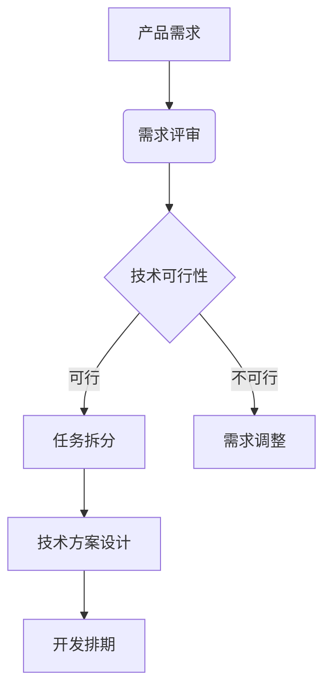

# 开发指南

## 📋 文档说明

本文档详细描述了 Auto U2A Polit 系统的开发规范、编码标准、项目结构和开发流程，帮助开发者快速上手并保持代码质量。

## 🏗️ 项目架构

### 前后端分离架构

```
┌─────────────────┐    ┌─────────────────┐
│  前端 (Vue3)     │    │  后端 (SpringBoot) │
│                 │    │                 │
│ ├─ API 层       │◄──►│ ├─ Controller  │
│ ├─ 状态管理      │    │ ├─ Service     │
│ ├─ 路由         │    │ ├─ Repository  │
│ ├─ 组件         │    │ ├─ Entity      │
│ └─ 视图         │    │ └─ DTO         │
└─────────────────┘    └─────────────────┘
         │                        │
         └─────► 数据库/Redis ◄────┘
```

### 技术栈选择原则

1. **成熟稳定**：选择经过大规模验证的技术
2. **社区活跃**：确保有良好的技术支持和生态
3. **性能优秀**：满足高并发场景需求
4. **易于维护**：代码可读性和可维护性优先

## 📁 项目结构规范

### 后端项目结构

```
src/main/java/com/auto/u2a/polit/
├── Application.java          # 启动类
├── config/                   # 配置类
│   ├── WebMvcConfig.java     # Web MVC配置
│   ├── SecurityConfig.java   # 安全配置
│   └── RedisConfig.java      # Redis配置
├── controller/               # 控制器层
│   ├── AuthController.java   # 认证控制器
│   ├── UserController.java   # 用户控制器
│   └── RoleController.java   # 角色控制器
├── dto/                      # 数据传输对象
│   ├── request/              # 请求DTO
│   │   ├── LoginRequest.java
│   │   └── UserCreateRequest.java
│   └── response/             # 响应DTO
│       ├── ApiResponse.java
│       └── UserResponse.java
├── entity/                   # 实体类
│   ├── User.java
│   ├── Role.java
│   └── Permission.java
├── repository/               # 数据访问层
│   ├── UserRepository.java
│   ├── RoleRepository.java
│   └── PermissionRepository.java
├── service/                  # 业务逻辑层
│   ├── impl/                 # 实现类
│   │   ├── UserServiceImpl.java
│   │   └── RoleServiceImpl.java
│   ├── UserService.java      # 服务接口
│   └── RoleService.java
├── security/                 # 安全相关
│   ├── JwtTokenProvider.java
│   ├── UserDetailsServiceImpl.java
│   └── SecurityUtils.java
└── util/                     # 工具类
    ├── BeanUtils.java
    └── DateUtils.java
```

### 前端项目结构

```
src/
├── api/                      # API接口
│   ├── modules/              # 模块化接口
│   │   ├── auth.ts          # 认证接口
│   │   ├── user.ts          # 用户接口
│   │   └── permission.ts    # 权限接口
│   └── index.ts             # 统一出口
├── assets/                   # 静态资源
│   ├── images/              # 图片资源
│   └── styles/              # 样式文件
├── components/               # 公共组件
│   ├── base/                # 基础组件
│   │   ├── BaseButton.vue
│   │   └── BaseTable.vue
│   ├── layout/              # 布局组件
│   │   ├── AppHeader.vue
│   │   └── AppSidebar.vue
│   └── business/            # 业务组件
│       ├── UserModal.vue
│       └── RoleModal.vue
├── composables/              # 组合式API
│   ├── useAuth.ts           # 认证逻辑
│   ├── usePermission.ts     # 权限逻辑
│   └── useTable.ts          # 表格逻辑
├── router/                   # 路由配置
│   └── index.ts
├── stores/                   # 状态管理
│   ├── auth.ts              # 认证状态
│   ├── user.ts              # 用户状态
│   └── permission.ts        # 权限状态
├── types/                    # TypeScript类型
│   ├── api.ts               # API类型
│   ├── user.ts              # 用户类型
│   └── permission.ts        # 权限类型
├── utils/                    # 工具函数
│   ├── request.ts           # 请求封装
│   ├── storage.ts           # 存储工具
│   └── validate.ts          # 验证工具
├── views/                    # 页面视图
│   ├── auth/                # 认证页面
│   ├── system/              # 系统管理
│   └── permission/          # 权限管理
├── App.vue                   # 根组件
└── main.ts                   # 入口文件
```

## 📝 编码规范

### Java 编码规范

#### 命名规范
```java
// 类/接口：大驼峰
public class UserServiceImpl implements UserService

// 方法/变量：小驼峰
public List<UserDTO> queryUserList(String username)

// 常量：全大写+下划线
public static final int MAX_RETRY_COUNT = 3;

// 包名：全小写，点分隔
package com.auto.u2a.polit.controller;
```

#### 代码风格
```java
/**
 * 用户服务实现类
 */
@Service
@Transactional(readOnly = true)
public class UserServiceImpl implements UserService {
    
    private final UserRepository userRepository;
    private final RoleRepository roleRepository;
    
    @Autowired
    public UserServiceImpl(UserRepository userRepository, RoleRepository roleRepository) {
        this.userRepository = userRepository;
        this.roleRepository = roleRepository;
    }
    
    /**
     * 根据用户名查询用户
     * 
     * @param username 用户名
     * @return 用户信息
     */
    @Override
    @Transactional(readOnly = true)
    public Optional<User> findByUsername(String username) {
        return userRepository.findByUsername(username);
    }
    
    /**
     * 创建用户
     * 
     * @param request 用户创建请求
     * @return 创建的用户ID
     */
    @Override
    @Transactional
    public Long createUser(UserCreateRequest request) {
        // 参数验证
        Validate.notBlank(request.getUsername(), "用户名不能为空");
        Validate.notBlank(request.getPassword(), "密码不能为空");
        
        // 业务逻辑
        if (userRepository.existsByUsername(request.getUsername())) {
            throw new BusinessException("用户名已存在");
        }
        
        User user = new User();
        user.setUsername(request.getUsername());
        user.setPassword(passwordEncoder.encode(request.getPassword()));
        user.setEmail(request.getEmail());
        user.setStatus(UserStatus.ENABLED);
        
        User savedUser = userRepository.save(user);
        return savedUser.getId();
    }
}
```

#### 关键规范
- **禁止魔法数字**：使用常量或枚举替代
- **单一职责原则**：每个类/方法只负责一个功能
- **依赖注入**：使用构造器注入，避免字段注入
- **事务管理**：在Service层使用`@Transactional`
- **异常处理**：统一异常处理，不捕获无关异常

### Vue3 + TypeScript 编码规范

#### 组件规范
```vue
<template>
  <div class="user-table">
    <!-- 使用语义化标签 -->
    <el-card header="用户列表">
      <!-- 搜索区域 -->
      <div class="search-area">
        <el-input
          v-model="searchParams.username"
          placeholder="请输入用户名"
          clearable
          @clear="handleSearch"
        />
        <el-button type="primary" @click="handleSearch">
          搜索
        </el-button>
      </div>
      
      <!-- 表格区域 -->
      <el-table :data="tableData" v-loading="loading">
        <el-table-column prop="username" label="用户名" />
        <el-table-column prop="email" label="邮箱" />
        <el-table-column prop="status" label="状态">
          <template #default="scope">
            <el-tag :type="scope.row.status ? 'success' : 'danger'">
              {{ scope.row.status ? '启用' : '禁用' }}
            </el-tag>
          </template>
        </el-table-column>
      </el-table>
      
      <!-- 分页 -->
      <el-pagination
        v-model:current-page="pagination.current"
        v-model:page-size="pagination.size"
        :total="pagination.total"
        @size-change="handleSizeChange"
        @current-change="handleCurrentChange"
      />
    </el-card>
  </div>
</template>

<script setup lang="ts">
// 1. 导入依赖
import { ref, reactive, onMounted } from 'vue'
import { ElMessage } from 'element-plus'
import type { User } from '@/types/user'

// 2. 类型定义
interface SearchParams {
  username: string
  status?: number
}

interface Pagination {
  current: number
  size: number
  total: number
}

// 3. 响应式数据
const loading = ref(false)
const tableData = ref<User[]>([])

const searchParams = reactive<SearchParams>({
  username: ''
})

const pagination = reactive<Pagination>({
  current: 1,
  size: 10,
  total: 0
})

// 4. 方法定义
const fetchUserList = async () => {
  try {
    loading.value = true
    const response = await userApi.getUserList({
      ...searchParams,
      page: pagination.current,
      size: pagination.size
    })
    
    tableData.value = response.data.items
    pagination.total = response.data.total
  } catch (error) {
    ElMessage.error('获取用户列表失败')
  } finally {
    loading.value = false
  }
}

const handleSearch = () => {
  pagination.current = 1
  fetchUserList()
}

const handleSizeChange = (size: number) => {
  pagination.size = size
  fetchUserList()
}

const handleCurrentChange = (current: number) => {
  pagination.current = current
  fetchUserList()
}

// 5. 生命周期
onMounted(() => {
  fetchUserList()
})
</script>

<style scoped>
.user-table {
  padding: 20px;
}

.search-area {
  margin-bottom: 20px;
  display: flex;
  gap: 10px;
}
</style>
```

#### 关键规范
- **TypeScript严格模式**：禁止使用`any`类型
- **组合式API**：优先使用`<script setup>`语法
- **响应式数据**：使用`ref`和`reactive`管理状态
- **组件通信**：使用`props`和`emit`进行父子组件通信
- **样式作用域**：使用`scoped`避免样式污染

## 🔧 开发工具配置

### IDE 配置

#### VS Code 配置 (.vscode/settings.json)
```json
{
  "typescript.preferences.importModuleSpecifier": "relative",
  "editor.codeActionsOnSave": {
    "source.fixAll.eslint": true,
    "source.organizeImports": true
  },
  "editor.formatOnSave": true,
  "editor.defaultFormatter": "esbenp.prettier-vscode",
  "files.associations": {
    "*.vue": "vue"
  },
  "emmet.includeLanguages": {
    "vue-html": "html",
    "vue": "html"
  }
}
```

#### IntelliJ IDEA 配置
- 安装插件：Lombok、MyBatisX、Vue.js
- 配置代码风格：使用Google Java Style
- 启用自动导入优化

### Git 配置

#### .gitignore 配置
```gitignore
# 后端忽略文件
/target/
/.idea/
*.iml
*.log

# 前端忽略文件
/node_modules/
/dist/
/.vscode/

# 环境变量文件
.env.local
.env.*.local

# 日志文件
logs/
*.log
npm-debug.log*
```

#### Git Hook 配置
```bash
#!/bin/bash
# .git/hooks/pre-commit

# 后端代码检查
mvn checkstyle:check
mvn spotbugs:check

# 前端代码检查
cd auto-u2a-polit-frontend
npm run lint

# 单元测试
mvn test
npm run test:unit
```

## 🚀 开发流程

### 1. 需求分析


### 2. 代码开发

#### 功能开发步骤
1. **数据库设计**：设计表结构和索引
2. **后端开发**：实体类 → Repository → Service → Controller
3. **前端开发**：API接口 → 类型定义 → 组件开发 → 页面集成
4. **接口联调**：前后端接口对接和测试
5. **功能测试**：单元测试和集成测试

#### 代码审查要点
- **架构符合性**：是否符合5A6S规范
- **代码质量**：是否有重复代码、魔法数字
- **安全漏洞**：SQL注入、XSS等安全问题
- **性能影响**：是否有性能瓶颈
- **测试覆盖**：是否有足够的测试用例

### 3. 测试验证

#### 测试策略
| 测试类型 | 工具 | 覆盖率要求 | 执行频率 |
|---------|------|-----------|----------|
| 单元测试 | JUnit5 + Vitest | ≥70% | 每次提交 |
| 集成测试 | Testcontainers | ≥40% | 每日构建 |
| E2E测试 | Cypress | 核心路径 | 每次发布 |
| 性能测试 | JMeter + k6 | 关键接口 | 每月一次 |

### 4. 部署上线

#### 发布流程
1. **代码合并**：功能分支合并到develop分支
2. **自动化测试**：CI/CD流水线执行测试
3. **构建镜像**：Docker镜像构建和推送
4. **预发验证**：预发环境功能验证
5. **生产发布**：蓝绿部署或滚动更新
6. **监控告警**：生产环境监控和告警配置

## 🔍 调试技巧

### 后端调试

#### 日志配置
```yaml
# application.yml
logging:
  level:
    com.auto.u2a.polit: DEBUG
    org.springframework.security: DEBUG
  file:
    path: ./logs
    name: application.log
  pattern:
    console: "%d{yyyy-MM-dd HH:mm:ss} [%thread] %-5level %logger{36} - %msg%n"
    file: "%d{yyyy-MM-dd HH:mm:ss} [%thread] %-5level %logger{36} - %msg%n"
```

#### 调试端点
```bash
# 健康检查
curl http://localhost:8080/actuator/health

# 应用信息
curl http://localhost:8080/actuator/info

# 指标监控
curl http://localhost:8080/actuator/metrics
```

### 前端调试

#### Vue Devtools
```javascript
// 开发环境启用Devtools
if (process.env.NODE_ENV === 'development') {
  app.config.devtools = true
}
```

#### 网络请求调试
```javascript
// 请求拦截器
axios.interceptors.request.use(config => {
  console.log('请求参数:', config)
  return config
})

// 响应拦截器
axios.interceptors.response.use(response => {
  console.log('响应数据:', response)
  return response
})
```

## 📚 学习资源

### 官方文档
- [Spring Boot 官方文档](https://spring.io/projects/spring-boot)
- [Vue 3 官方文档](https://v3.vuejs.org/)
- [Element Plus 文档](https://element-plus.org/)
- [MyBatis Plus 文档](https://baomidou.com/)

### 最佳实践
- [阿里巴巴Java开发手册](https://github.com/alibaba/p3c)
- [Google Java Style Guide](https://google.github.io/styleguide/javaguide.html)
- [Vue 3 风格指南](https://v3.vuejs.org/style-guide/)

### 社区资源
- [Spring 中国社区](https://spring.io.cn/)
- [Vue.js 中文社区](https://vuejs.org/)
- [掘金前端专栏](https://juejin.cn/frontend)

---

*最后更新：2024年1月*

**注意**：开发过程中遇到问题请及时在团队内沟通，确保代码质量和项目进度。