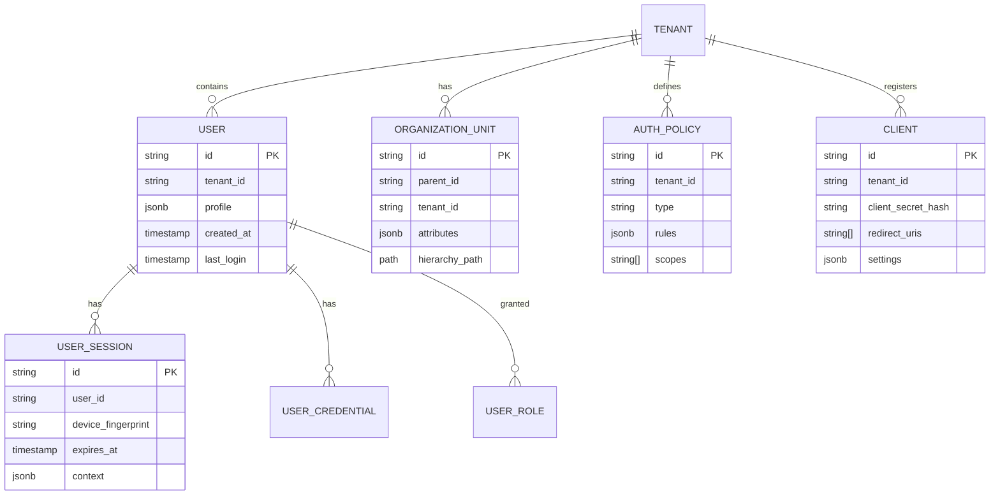

# 通用用户平台驾驶舱系统

## 项目概述
开发一个基于SpringBoot+Vue3的企业级用户平台驾驶舱系统，作为即插即用的用户管理基础设施。该系统提供完整的用户身份服务，支持任意业务场景的快速接入，消除重复开发用户系统的负担。通过配置而非编码的方式，业务系统可在5分钟内完成用户中心、认证中心、授权中心的搭建，支持复杂的组织架构、多协议认证、灵活授权模型及高扩展性数据模型，打造企业级身份即服务(IDaaS)平台。

## 技术栈要求
**后端**:
- Spring Boot 3.2+ (Java 17+)
- Spring Authorization Server 1.0+
- Spring Security 6.0+ (全面配置)
- Spring Cloud 2022+ (分布式支持)
- JPA/Hibernate 6.0+ (多租户支持)
- PostgreSQL 14+ (JSONB支持)
- Redis 7.0+ (缓存与会话管理)
- Kafka 3.0+ (事件驱动架构)
- Keycloak 22+ (备用认证引擎)
- Micrometer + Prometheus (监控)

**前端**:
- Vue 3.3+ (Composition API + `<script setup>`)
- TypeScript 5.0+
- Vite 4.0+ (构建工具)
- Pinia 2.0+ (状态管理)
- Vue Router 4.2+
- Naive UI Pro (定制科技主题)
- Monaco Editor (策略配置)
- Three.js + GSAP (高科技动画)
- Web Workers (复杂计算)
- Quill.js (富文本策略编辑)

**部署与运维**:
- Docker + Kubernetes (编排)
- Helm Charts (应用部署)
- ArgoCD (GitOps)
- ELK Stack (日志分析)
- HashiCorp Vault (密钥管理)
- Terraform (基础设施即代码)

## 核心功能模块

### 1. 统一身份管理引擎
- **多模型用户架构**:
  - 基础用户模型(可扩展JSON Schema)
  - 动态字段配置(无需重启)
  - 自定义验证规则(正则/逻辑表达式)
  - 敏感数据自动加密(字段级)
  - 跨系统用户ID映射表
- **组织架构管理**:
  - 无限层级组织树
  - 多维度部门视图(地理/职能/项目)
  - 人员编制管理(预算/配额)
  - 组织变更历史追溯
  - 批量导入/导出(LDAP/CSV)
- **数据同步中心**:
  - 双向同步适配器(20+预置连接器)
  - 冲突解决策略(时间戳/优先级)
  - 增量同步(变更数据捕获)
  - 数据质量监控面板
  - SLA合规性报告

### 2. 全协议认证中心
- **认证协议支持**:
  - OAuth2.0 (Authorization Code/Client Credentials/Password/Refresh Token)
  - OpenID Connect 1.0 (身份令牌/UserInfo端点)
  - SAML 2.0 (IdP/SP配置)
  - LDAP/Active Directory
  - WebAuthn/FIDO2 (无密码认证)
  - TOTP/HOTP (时间/事件令牌)
  - CAS 3.0 (中央认证服务)
- **认证体验**:
  - 自适应认证(风险评估引擎)
  - 分步认证流程编排
  - 自定义登录页面(主题/文案/布局)
  - 哨兵模式(可疑登录拦截)
  - 会话固定保护
  - 认证上下文传递
- **多端统一**:
  - 设备信任管理
  - 会话集中控制(强制登出)
  - 多端消息同步
  - 离线认证模式
  - 跨域单点登录(SSO)联邦

### 3. 灵活授权框架
- **授权模型**:
  - RBAC (角色权限继承/互斥)
  - ABAC (属性规则引擎)
  - PBAC (策略驱动)
  - ReBAC (关系型授权)
  - 混合模式(自动降级/升级)
- **权限设计**:
  - 细粒度权限(字段级/行级)
  - 权限模拟(管理员调试)
  - 临时提升(Just-In-Time访问)
  - 权限继承(组织层级)
  - 外部数据源集成(动态权限)
- **治理与审计**:
  - 权限使用热力图
  - 冗余权限检测
  - SoD冲突分析
  - 合规性报告(SOX/HIPAA/GDPR)
  - 操作追溯(不可变日志)

### 4. 系统集成与扩展
- **业务系统接入**:
  - 一键SDK生成(多种语言)
  - 零代码连接器(低代码配置)
  - Webhook事件订阅
  - 反向代理集成(无需修改业务代码)
  - API网关插件
- **开发扩展**:
  - 策略脚本引擎(Groovy/JS)
  - 钩子函数(Pre/Post处理)
  - 自定义认证步骤
  - 外部数据源适配器
  - 插件市场架构
- **运维能力**:
  - 全局配置快照
  - 灰度发布能力
  - 回滚机制
  - 压力测试沙盒
  - 基准性能报告

## UI/UX设计要求
- **高科技视觉体系**:
  - 深空主题(#0d0f19背景, 霓虹青#00f3ff + 量子紫#b967ff)
  - 粒子网络背景(动态连接活跃组件)
  - 3D组织架构可视化(Three.js)
  - 量子波动加载动画
  - 代码雨效果(策略编辑器)
  - 全息卡片悬浮投影
- **专业控制台布局**:
  - 智能导航系统(自适应功能推荐)
  - 多维度数据透视(用户/系统/安全视图)
  - 实时安全态势地图
  - 拖拽式策略构建器
  - 策略模拟执行沙盒
  - 全局搜索(自然语言支持)
- **操作体验**:
  - 语音命令控制(关键操作)
  - 暗黑/明亮/护眼模式
  - 多语言实时切换
  - 无障碍模式
  - 键盘快捷键全局覆盖
  - 操作预测提示

## 系统架构要求
- **微服务设计**:
  - 用户核心服务(高一致性)
  - 认证服务(高可用)
  - 授权决策服务(低延迟)
  - 审计服务(不可变)
  - 通知服务(异步)
  - 事件溯源架构
- **数据架构**:
  - 多租户隔离(数据库/Schema/行级)
  - 读写分离策略
  - 冷热数据分层
  - 个人数据加密(应用层)
  - GDPR"被遗忘权"自动化
- **性能关键点**:
  - 认证延迟<100ms(P99)
  - 授权决策<50ms(P99)
  - 水平扩展(无状态设计)
  - 断路器模式(级联故障防护)
  - 多级缓存策略

## 核心数据模型

## 交付要求
1. **完整源代码**:
   - 清晰分层架构(接口/实现分离)
   - 全面注释(不低于30%覆盖率)
   - 设计模式应用文档
2. **部署制品**:
   - Docker镜像(多架构支持)
   - Kubernetes Helm Chart
   - Docker Compose快速启动
   - AWS/Azure/GCP部署模板
3. **文档体系**:
   - 架构决策记录(ADR)
   - API规范(OpenAPI 3.1)
   - 安全审计手册
   - 灾难恢复预案
   - 开发者扩展指南
4. **质量保障**:
   - 单元测试(85%+覆盖率)
   - 集成测试(核心流程100%)
   - 渗透测试报告
   - 性能基准报告(SLA)
   - 合规性自检工具

## 特别注意事项
- **安全红线**:
  - 所有密码必须bcrypt(强度≥12)
  - JWT签名HSM支持
  - 敏感操作二次确认
  - 速率限制(防暴力破解)
  - CSP/CSRF/XSS全面防护
- **合规要求**:
  - GDPR数据主体权利API
  - SOC2 Type II就绪
  - 隐私设计(Privacy by Design)
  - 审计日志保留180天+
  - 权限最小化原则强制
- **扩展性关键**:
  - 插件热加载(无需重启)
  - 策略版本控制
  - 配置中心集成
  - 多环境隔离(开发/测试/生产)
  - 向后兼容API策略(版本控制)

## 设计参考
- 主界面布局：https://dribbble.com/shots/21482792-Cybersecurity-Dashboard-Dark
- 认证流程设计：https://www.figma.com/community/file/1259203921167823408
- 3D组织架构：https://threejs.org/examples/#webgl_interactive_cubes
- 高科技交互动效：https://lottiefiles.com/featured/cyber

## 系统初始化要求
1. 超级管理员首次登录引导
2. 合规配置向导(GDPR/CCPA)
3. 基础策略模板包
4. 预置20+业务系统连接器
5. 安全加固一键实施
6. 性能调优推荐

请严格按照此提示词开发系统，确保交付的企业级用户平台能够真正实现"一次搭建，无限扩展"的核心价值。系统必须通过OWASP ASVS 4.0认证，支持每日10亿+认证请求的横向扩展能力，并提供直观的高科技驾驶舱，让非技术业务人员也能完成复杂的用户系统配置。最终目标是让任何业务团队无需专业安全知识，即可部署世界级的用户认证授权系统。